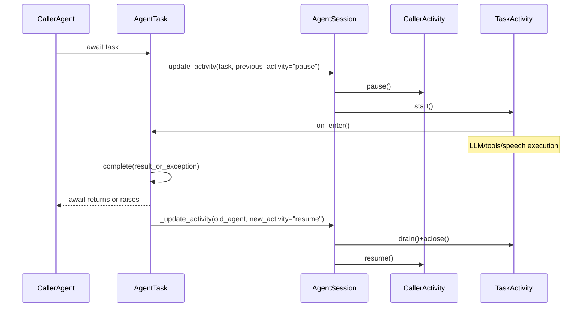

# AgentTask Runtime Flow (Python Reference)

This document explains how Python `AgentTask` works at runtime so you can read related code and trace behavior confidently.

Primary reference files:

- `livekit-agents/livekit/agents/voice/agent.py`
- `livekit-agents/livekit/agents/voice/agent_session.py`
- `livekit-agents/livekit/agents/voice/agent_activity.py`
- `livekit-agents/livekit/agents/voice/generation.py`
- `livekit-agents/livekit/agents/llm/chat_context.py`
- `livekit-agents/livekit/agents/beta/workflows/task_group.py`

---

## 1) Mental model

`AgentTask[T]` is a temporary, awaitable sub-agent that:

1. pauses the currently active agent activity,
2. runs its own activity (`on_enter`, LLM/tools, speech),
3. resolves a typed result via `complete(...)`,
4. resumes the caller activity,
5. merges useful chat history back to the caller.

Treat it as an inline conversational coroutine that borrows the session and returns.

---

## 2) Two activity transition modes (must distinguish)

### Mode A: close/start (normal handoff)

Used by `session.update_agent(new_agent)` and handoff returns.

- old activity: `drain()` + `aclose()`
- new activity: `start()`
- no implicit return to the old agent

### Mode B: pause/resume (inline AgentTask)

Used by `await some_task`.

- old activity: `pause()` (kept alive)
- task activity: `start()`
- task finishes (`complete(...)`)
- task activity: `drain()` + `aclose()`
- old activity: `resume()`

`AgentTask` relies on Mode B.

---

## 3) End-to-end sequence

---

## 4) What `AgentTask` adds over `Agent`

In `agent.py`, `AgentTask` extends `Agent` and introduces:

- internal future (`__fut`) to represent task completion,
- non-reentrancy guard (`__started`),
- `done()` state,
- `complete(value_or_exception)`,
- `__await__`/`__await_impl`.

Without `complete(...)`, `await task` never resolves.

---

## 5) `__await_impl` control flow (core)

When caller does `result = await task`:

1. validate usage context and reentrancy,
2. capture old activity/agent,
3. switch to task activity with `previous_activity="pause"`,
4. await task future,
5. in `finally`, if session is still on this task:
   - merge task chat context into old agent chat context
   - resume old activity with `new_activity="resume"`

This `finally` resume logic is the stack-like return behavior.

---

## 6) `complete(...)` semantics

- `complete(value)` -> awaiter receives `value`
- `complete(exception)` -> awaiter raises

It also updates current speech-handle final-output plumbing when present.

---

## 7) `AgentSession._update_activity` behavior matrix

Key params:

- `previous_activity`: `"close"` | `"pause"`
- `new_activity`: `"start"` | `"resume"`

Meaning:

- `close + start`: full handoff to new activity
- `pause + start`: enter inline task
- `close + resume`: return to previously paused activity

For resume path, an existing `agent._activity` is required.

---

## 8) `AgentActivity.pause()` vs `resume()`

`pause()`:

- pauses scheduling/draining logic,
- closes runtime session resources/listeners,
- preserves activity object for later resume.

`resume()`:

- re-establishes runtime session resources/listeners,
- restarts scheduling,
- does **not** run `on_enter()` again.

This is why caller state can continue seamlessly.

---

## 9) Hook execution model

`on_enter` and `on_exit` run as speech tasks in activity runtime.
They are inline-task-compatible, so nested `await AgentTask(...)` is valid.

---

## 10) Tools, instructions, models during task

While task is active:

- instructions are applied like any `Agent`,
- tools are resolved from session + task (+ mcp tools),
- model resolution is task-first, session-fallback.

So tasks can temporarily override LLM/STT/TTS/VAD/tool behavior.

---

## 11) Chat context merge on return

On task completion, caller chat context merges task context with rules:

- dedupe by `id`,
- insert by chronological `created_at`,
- exclude function-call internals,
- exclude instructions (`system`/`developer`) for resume path.

This preserves useful conversation outcomes without tool noise.

---

## 12) Difference from tool handoff returns

Tool return handoff (`Agent` return) and `await AgentTask` both switch agents, but:

- handoff return -> close/start semantics (role transfer),
- `await AgentTask` -> pause/resume semantics (inline subroutine + return).

Do not conflate these paths while debugging.

---

## 13) Canonical Python usage patterns

- Survey workflow (`examples/survey/survey_agent.py`): staged typed tasks with `TaskGroup`.
- IVR workflow (`examples/bank-ivr/ivr_system_agent.py`): direct inline `await task` in menu loops.
- `TaskGroup` itself (`beta/workflows/task_group.py`) is implemented on top of `AgentTask`.

---

## 14) Common pitfalls

- calling `complete(...)` twice -> error,
- awaiting same task instance twice -> error,
- missing `complete(...)` path -> hang,
- concurrent external `update_agent(...)` during task may bypass normal resume path.

---

## 15) Practical tracing checklist

When reading AgentTask code, confirm:

1. where task is created,
2. where `await task` happens,
3. where `complete(...)` is guaranteed,
4. whether transition mode is pause/resume vs close/start,
5. how merge filters are configured,
6. whether concurrent handoff can race with task return.

If all six are clear, your runtime mental simulation is correct.
